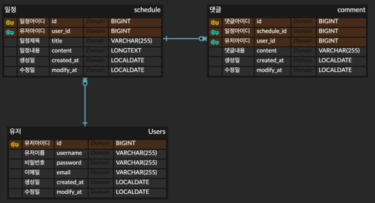

# JPA를 활용한 일정 관리 

---
## 🛠️ 사용 기술
    

---

## 📑 최종 ERD
- Schedule, Users, Comment 테이블

---
## 📝 최종 API 명세서
- PostMan 으로 작성한 API 명세서
- 

---
## 📌 구현 기능
- 일정, 유저, 댓글의 각 CRUD 구현
- 각 Entity를 단방향 연관관계 매핑
- 예외처리(빈값, 조회 불가, 검증 실패 등)
- 서블릿 필터와 세션으로 로그인, 로그아웃 로직 구현
- 비밀번호 암호화 적용
- 일정 전체조회에 서브 쿼리를 활용하여 페이징 적용
---
